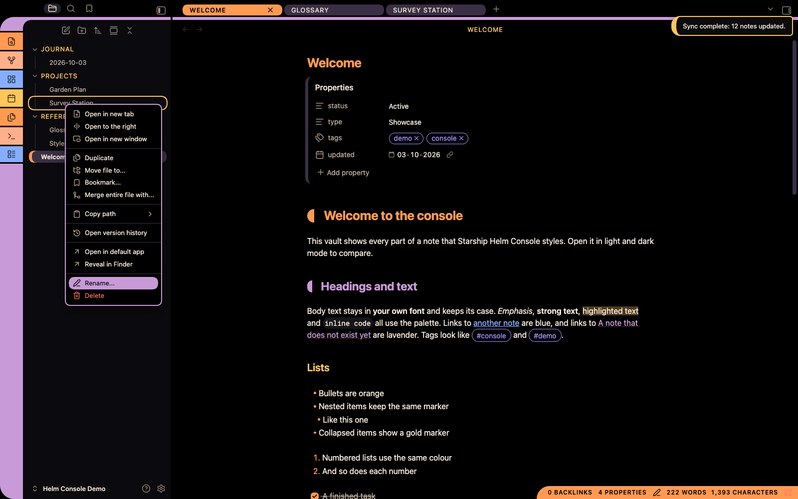
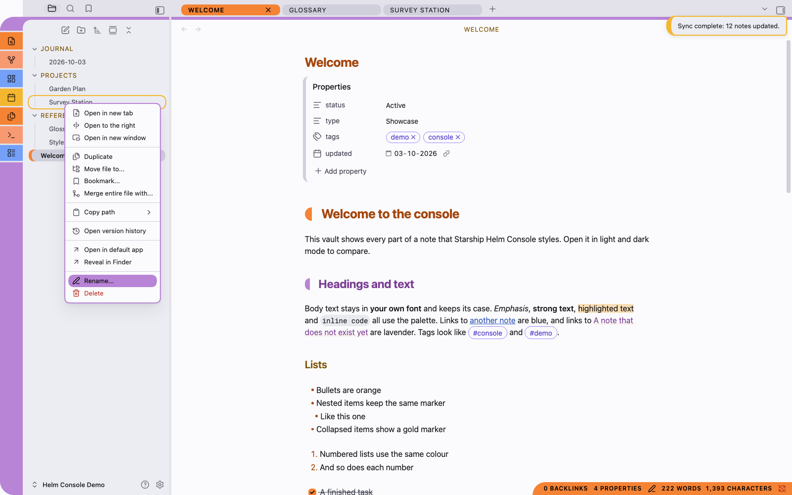

# Starship Helm Console

**An unofficial theme for Obsidian inspired by LCARS, the computer interface style from
*Star Trek: The Next Generation*. Not affiliated with or endorsed by Paramount Global or
CBS Studios.**

Swept colour bars, rounded end caps and segmented panels on a black screen, with a
clean, cool light mode alongside.

> **This is an independent, unofficial, fan-made theme.** It is **inspired by** the LCARS
> interface style seen in *Star Trek: The Next Generation*. It is **not affiliated with,
> endorsed by, sponsored by, licensed by, or connected to** Paramount Global, CBS Studios,
> or any other rights-holder. It reproduces no artwork, logos, insignia or typefaces from
> any production. Star Trek and related marks are trademarks of CBS Studios Inc.; LCARS is
> a term from that franchise. Both are used here only to describe the style. See
> [Affiliation and intellectual property](#affiliation-and-intellectual-property).

---

## Contents

- [What this is](#what-this-is)
- [At a glance](#at-a-glance)
- [Screenshots](#screenshots)
- [Dark and light](#dark-and-light)
- [What the theme changes](#what-the-theme-changes)
- [The palette](#the-palette)
- [The geometry](#the-geometry)
- [Installation](#installation)
- [Options](#options)
- [Fonts](#fonts)
- [Working with plugins](#working-with-plugins)
- [Accessibility](#accessibility)
- [Requirements and platform support](#requirements-and-platform-support)
- [Documentation](#documentation)
- [Building from source](#building-from-source)
- [Quality checks](#quality-checks)
- [Contributing](#contributing)
- [Affiliation and intellectual property](#affiliation-and-intellectual-property)
- [Licence](#licence)

## What this is

Starship Helm Console is an Obsidian theme in the LCARS idiom, built from one idea: draw the
interface as **flat coloured bars**.

The style comes from LCARS, the panelled computer interface seen on screen in
*Star Trek: The Next Generation* and the series that followed it. There are no bevels, shadows or gradients. Panels are blocks of solid
colour. Where two panels meet they join with a curved "elbow". Buttons and tabs are
pills with rounded ends. Interface labels are short words in capitals. Colour does the
work that borders and shadows usually do.

The theme brings that look to Obsidian without getting in the way of writing. Your notes
keep their own fonts and their own case. The bars and caps sit around your text, not
over it, and every text colour meets the WCAG 4.5:1 contrast standard.

## At a glance

| | |
| --- | --- |
| **Modes** | Dark (the reference look) and a clean, cool light mode |
| **Fonts** | None set. Obsidian's defaults, or your choice, always apply |
| **Contrast** | 4.5:1 or better for all text, in both modes, enforced by tests |
| **Plugins needed** | None. Style Settings is optional, for three switches |
| **Remote resources** | None. Nothing is downloaded |
| **Obsidian version** | 1.6.0 or later |
| **Licence** | MIT |

## Screenshots

All screenshots come from the demo vault in [`docs/Helm Console Demo`](docs/Helm%20Console%20Demo).
It holds a handful of sample notes that between them use every element the theme styles,
so you can open it yourself and compare. Obsidian's own fonts are used throughout,
because the theme sets none.

### The workspace

<p align="center">
  
</p>

<p align="center"><em><strong>Dark mode.</strong> From left to right: the segmented
ribbon, whose top curves into the lavender bar under the tab row; the file explorer with
gold folder names and the open file marked by an orange cap; the pill tabs, with the
active one in orange; and the note, with its orange and lavender heading caps. The
orange status bar sits in the lower right.</em></p>

<p align="center">
  
</p>

<p align="center"><em><strong>Light mode.</strong> The same window. The page is
near-white, the tab row and dividers are a light cool grey, and the sidebar is a shade
darker so the parts of the window stay distinct. The bars keep their black labels;
headings and links switch to deeper inks so they stay readable on white.</em></p>

### Gallery

Each row shows the same scene in both modes. Select an image to open it full size.

| | Dark | Light |
| --- | --- | --- |
| **Note content** in reading view: callouts with coloured caps and tints, the segmented rule, a table with a lavender header, and a code block with a blue cap | [](docs/images/02-content-dark.png) | [](docs/images/02-content-light.png) |
| **Command palette**, searching for "toggle": the chosen command is a full orange bar, and the letters you typed are picked out in every result | [](docs/images/03-palette-dark.png) | [](docs/images/03-palette-light.png) |
| **Settings**: the chosen section is an orange bar, buttons are lavender pills, and the font-size slider and toggles are pills too | [](docs/images/04-settings-dark.png) | [](docs/images/04-settings-light.png) |
| **A file's menu and a notice**: the row under the pointer is a lavender bar, Delete is red, and the notice has a gold cap | [](docs/images/05-menu-notice-dark.png) | [](docs/images/05-menu-notice-light.png) |

## Dark and light

Each mode was designed on its own; neither is an automatic inversion of the other.
Switch between them with **Settings → Appearance → Base colour scheme**.

### Dark

Dark mode is the look the style is known for: bright bars on a black screen.

- The page, the tab row and the gaps between panes are pure black.
- Sidebars are a near-black panel, so they read as a separate surface.
- Bars are bright orange, gold, peach, lavender, violet, blue and red, always with
  black labels.
- Body text is a warm off-white, not pure white, which is easier on the eyes over a
  long session.

### Light

Light mode is clean and cool, with no black anywhere.

- The page is near-white.
- A light grey frame covers the tab rows, the gaps in the ribbon and the dividers
  between panes. Sidebars are a slightly darker grey, so each part of the window stays
  distinct without dark chrome.
- The bars are more saturated than in dark mode so they hold their own on white. They
  still carry black labels.
- Coloured text (headings, links, folder names) uses deeper versions of the bar
  colours, so it still meets 4.5:1 on white.

## What the theme changes

The theme styles the whole application, not just the editor.

### The window

| Dark | Light |
| --- | --- |
|  |  |

*The ribbon and the elbow. Each ribbon icon sits on its own coloured segment, and the
segments are separated by thin gaps. At the top, the column's rounded corner joins the
lavender bar under the tab row, and a small concave curve fills the inside of the bend.
In the file explorer, folders are gold capitals and the open file is a dim bar with an
orange cap on its left edge.*

- **The ribbon** (the column of icons at the far left) is a stack of coloured segments
  separated by thin gaps. The order is orange, peach, blue, gold, repeating, with the
  settings buttons at the foot in violet. The column's rounded top corner joins a
  lavender bar that runs along the foot of the tab row, and a concave inner curve
  completes the elbow.
- **Tabs** are pills. Inactive tabs are dim, and turn violet with black labels on
  hover. The active tab is peach, or orange in the pane you are working in.

  <br>
  
- **Sidebars** sit on a panel colour of their own. Sidebar tabs are icons, and the active
  one sits in a lavender pill.
- **The file explorer** shows folder names in gold. The open file is a dim bar with an
  orange end cap, and other selected files carry a gold cap.
- **The status bar** is an orange bar with a rounded left end, in the lower right of the
  window.

  
  
- **Interface labels** (tab titles, view headers, folder names, buttons, settings
  headings) are shown in capitals with open letter spacing.

### Your notes

- **Headings:** first-level headings carry an orange end cap and second-level headings
  a lavender one. Each cap is a small block with a rounded outer edge and a straight inner
  edge, centred on the heading text with a clear gap before it. Headings three to six
  are coloured gold, blue, violet and grey.
- **Horizontal rules** are segmented bars (orange, lavender, blue) with rounded ends.
- **Quotes** have a thick lavender bar down the left.
- **Callouts** have a thick coloured cap on the left and a light tint of the same
  colour behind them. Their titles are in capitals.
- **Code blocks** have a rounded blue cap on the left. Inline code and code blocks sit
  on a background that stands apart from the page in both modes.
- **Tables** have a lavender header row with black labels and a rounded top-left corner.
  Alternate rows are tinted.
- **Tags** are outlined violet pills.
- **Links** are blue. Links to notes that don't exist yet are lavender.
- **Properties** keep Obsidian's own layout, with property names in gold and a dim
  bar down the left of the block.

The text of your notes is never changed. Its font is your font and its case is your
case. Only interface labels are capitalised.

### Controls and overlays

- **Buttons** are filled pills: lavender by default, orange for the main action, red
  for destructive actions, and gold on hover.
- **Text fields and dropdowns** keep Obsidian's own shapes, in the theme's colours.
- **Toggles** are pills. On is orange; off is dim with a visible knob.
- **The command palette and quick switcher** show the selected row as a full orange bar
  with black text.
- **Menus** are rounded panels. The row under the pointer becomes a lavender bar, with a
  black label and icon.
- **Settings** shows the selected section as an orange bar.
- **Notices** (Obsidian's pop-up messages, including errors) are panels with a gold cap
  and border, so their text and links stay readable.
- **Tooltips** are peach pills.

| Dark | Light |
| --- | --- |
|   |   |

*A file's right-click menu, with **Rename…** under the pointer, and a notice. Menus keep
Obsidian's grouping and icons; the theme adds the rounded frame and the bar for the row
you're pointing at. Notices are dark or light panels with a thick gold cap, so error
messages and any links in them stay readable.*

## The palette

Every colour the theme uses is listed here. Nothing is hidden behind an image or a
generated gradient.

| Role | Dark | Light | Used for |
| --- | --- | --- | --- |
| Screen | `#000000` | `#fbfbfd` | The page |
| Frame | `#000000` | `#e2e2ea` | Tab rows, ribbon gaps, dividers |
| Panel | `#0c0a0e` | `#ededf2` | Sidebars |
| Code background | `#17141a` | `#eaeaf0` | Inline code and code blocks |
| Text | `#f4e8da` | `#15151b` | Body text |
| Muted text | `#bcab9a` | `#4a4a58` | Secondary text |
| Faint text | `#948472` | `#5e5e6c` | Hints and placeholders |
| Orange bar | `#ff9a52` | `#f58434` | Active tab, main buttons, status bar, H1 cap |
| Gold bar | `#ffc65c` | `#f5b630` | Hover, keyboard focus |
| Peach bar | `#ffb08a` | `#f79a72` | Active tab in other panes, tooltips |
| Lavender bar | `#c99ad8` | `#b884d6` | Ribbon, tab-row bar, buttons, table headers, H2 cap |
| Violet bar | `#a493ff` | `#988af7` | Tab hover, ribbon settings segment |
| Blue bar | `#86aeff` | `#73a0f7` | Ribbon segment, code-block cap |
| Red bar | `#ff7468` | `#f2705f` | Warnings, destructive buttons |
| Dim bar | `#3a2f44` | `#cfcfdc` | Inactive tabs, toggles when off |

Labels on bars are always black. The test suite checks every text and background pair
in both modes, at 4.5:1 for text and 3:1 for disabled controls.

## The geometry

| Property | Value | Notes |
| --- | --- | --- |
| Elbow radius | 28px | Where the ribbon turns into the tab-row bar |
| Bar thickness | 6px | The tab-row bar, rules, quote bars |
| Segment gap | 3px | Between ribbon segments |
| Pill radius | Fully round | Tabs, buttons, menu rows, the status bar end |
| Panel radius | 18px | Dialogs, callout caps, notices |
| Ribbon width | 46px | |
| Heading cap gap | 0.75em | Between a heading cap and its text |

## Installation

### Manually

1. Download `theme.css` and `manifest.json` from this repository.
2. In your vault, create the folder `.obsidian/themes/Starship Helm Console/`. The folder name
   must be exactly `Starship Helm Console`. The `.obsidian` folder is hidden on most systems.
3. Put both files in that folder.
4. In Obsidian, open **Settings → Appearance**. Under **Themes**, choose
   **Starship Helm Console**.
5. If the theme isn't listed, close and reopen Obsidian.

### From Obsidian's community themes

The theme hasn't been submitted to the directory yet. Once it's listed, open
**Settings → Appearance → Themes → Manage**, search for **Starship Helm Console** and choose
**Install and use**.

### Updating

Replace `theme.css` and `manifest.json` with the new versions. Obsidian doesn't reload a
theme when its file changes, so switch to another theme and back, or restart Obsidian.

## Options

The theme needs no plugins. If you have the
[Style Settings](https://github.com/mgmeyers/obsidian-style-settings) plugin, it adds a
**Starship Helm Console** section with three switches:

| Switch | What it does |
| --- | --- |
| **Mixed-case interface labels** | Keeps tab, header and button labels in their original case instead of capitals |
| **Plain ribbon** | Draws the ribbon as one plain bar instead of the swept, segmented column, and removes the tab-row bar |
| **Plain headings** | Removes the end caps from first- and second-level headings |

All three are off by default. You can also change colours and sizes with a CSS snippet;
the [User Guide](USERGUIDE.md#customising-with-a-css-snippet) shows how.

## Fonts

The theme sets no fonts at all. It uses Obsidian's default fonts, or whatever you choose
under **Settings → Appearance → Font** (interface font, text font and monospace font).
A test fails the build if a font is ever added to the theme.

## Working with plugins

The theme is written to stay out of plugins' way:

- **Plugin buttons** take the theme's colours through Obsidian's own variables, so
  plugins that restyle their buttons keep readable black labels on the bars. A plugin's
  own active or selected styles still apply.
- **Buttons inside properties, notices, note content, the editor, the file tree, the
  status bar and the view header are not filled.** Small inline buttons there keep
  Obsidian's quieter style.
- **File-colour plugins** that colour file names stay readable: the open file is shown
  as a dim bar with an orange cap rather than a bright fill that would hide the name's
  colour.

If a plugin looks wrong, see the
[User Guide's troubleshooting section](USERGUIDE.md#troubleshooting).

## Accessibility

- **Contrast:** all text meets 4.5:1 against its background, in both modes. Labels on
  bars meet 4.5:1. Disabled controls meet 3:1. The tests check every pairing.
- **Keyboard focus** is always visible as a gold outline.
- **Reduced motion:** if your system asks for reduced motion, the theme sets Obsidian's
  animation timings to zero, so panels, menus and dialogs appear without animating.
- **Increased contrast:** if your system asks for more contrast, muted and faint text
  is drawn at full strength and borders are strengthened.
- **Printing and PDF export** drop the colour bars, heading caps and screen palette in
  favour of black text on white.
- **Case:** if you find capitalised labels harder to read, the **Mixed-case interface
  labels** switch turns them off.

## Requirements and platform support

- Obsidian **1.6.0** or later.
- The theme is plain CSS and needs no plugins.

| Platform | Status |
| --- | --- |
| macOS desktop | Developed and tested on macOS with Obsidian 1.13 |
| Windows and Linux desktop | Expected to work, not yet tested. The ribbon's elbow is tuned for macOS's hidden title bar and may sit slightly differently with a native title bar |
| Mobile | Not yet tested |

## Documentation

- **[User Guide](USERGUIDE.md)**: a full, illustrated walkthrough of the theme,
  customisation with CSS snippets, plugin notes, troubleshooting and a FAQ.
- **[Regenerating the screenshots](docs/SCREENSHOTS.md)**: how the images are made from
  the demo vault.

## Building from source

`theme.css` is generated from the modules in `src/`. Edit those modules, never the
generated file.

```sh
npm install        # dev-only tools: oxlint, stylelint, TypeScript
npm run build      # regenerate theme.css from src/
npm run lint       # oxlint (anti-slop rules) on the TypeScript, stylelint on the CSS
npm run typecheck  # strict TypeScript check of scripts/ and tests/
npm test           # contrast, packaging, naming, font and token tests
npm run check      # all of the above, plus a check that theme.css is not stale
HELM_CONSOLE_VAULT=/path/to/vault npm run deploy   # build, then copy into a vault
```

The build needs only Node 22.18 or later, which runs the TypeScript scripts directly with
no compile step. There are no runtime dependencies. The only packages are dev-only tools.

### Source layout

| Path | Contents |
| --- | --- |
| `src/00-settings.css` | Style Settings options |
| `src/01-tokens.css` | Sizes and spacing shared by both modes |
| `src/02-palette-dark.css` | The dark palette |
| `src/03-palette-light.css` | The light palette |
| `src/04-obsidian-variables.css` | The palette mapped onto Obsidian's own variables |
| `src/10-workspace.css` | Ribbon, tabs, panels, file explorer, status bar |
| `src/20-content.css` | Headings, rules, quotes, callouts, code, tables, tags, properties |
| `src/30-controls.css` | Buttons, fields, toggles, sliders, focus |
| `src/40-overlays.css` | Dialogs, command palette, menus, notices, tooltips, settings |
| `src/90-accessibility.css` | Reduced motion, increased contrast, print |
| `theme.css` | Generated. Never edit by hand |
| `scripts/build.ts` | Concatenates `src/` in filename order. `--check` fails if `theme.css` is stale |
| `scripts/deploy.ts` | Copies `manifest.json` and `theme.css` into a vault's theme folder |
| `scripts/json.ts`, `scripts/project.ts` | The single place JSON is parsed, into named types |
| `tests/` | The test suite (TypeScript, `node --test`) |
| `.stylelintrc.json` | CSS lint rules: Obsidian's theme guidelines plus slop checks |
| `tools/oxlint/anti-slop/` | Vendored anti-slop lint rules |
| `.github/workflows/` | CI on every push; a release workflow that runs only when a version tag is pushed |
| `docs/Helm Console Demo/` | The demo vault the screenshots are taken from |
| `docs/images/` | Screenshots for the README and User Guide |
| `scripts/screenshots.sh` | Captures the screenshots from the demo vault |
| `screenshot.png` | The 512×288 image for Obsidian's community theme directory |

Palettes hold colours only. Structure lives in the component modules and refers to the
palette through `--hc-*` variables, so a colour change never touches structure.

## Quality checks

Three layers run the same checks: a pre-commit hook (enable it with
`git config core.hooksPath .githooks`), GitHub Actions on every push, and a Claude Code
hook that lints after every AI edit.

### Obsidian's guidelines, enforced

Obsidian's [theme guidelines](https://docs.obsidian.md/Themes/App+themes/Theme+guidelines)
and [developer policies](https://docs.obsidian.md/Developer+policies) are checked
automatically rather than by eye:

| Guideline | How it is enforced |
| --- | --- |
| Override general variables under `body` and colours under `.theme-light` / `.theme-dark` | The palette and Obsidian-variable modules are split exactly that way. A user's CSS snippet with the same selector overrides the theme |
| Use low-specificity selectors | stylelint caps every selector at `0,3,0`. Style Settings switches sit inside `:where()` so they add no weight, and where Obsidian draws a state from a variable the theme sets the variable instead of outranking Obsidian's rule |
| Keep assets local; themes may not load from the network | stylelint allows only `data:` URLs and bans `@import` and `@font-face` |
| Avoid `!important` | stylelint bans it outright. Reduced motion and print use Obsidian's variables instead |
| No obfuscation, ads or telemetry | `theme.css` is the readable source modules joined together, with no scripts |
| README, LICENSE, `manifest.json` and a 512×288 screenshot in the repository root | A packaging test checks all four, and reads the screenshot's real dimensions |

### Anti-slop

The scripts and tests are strict TypeScript, linted by the vendored
[anti-slop](https://github.com/dmmulroy/anti-slop) oxlint rules. They reject the
low-evidence patterns AI-written code tends to contain: `unknown` types, unsafe
dictionaries, unexplained type assertions, `typeof` probing, `Reflect` calls, broad object
parameters and module mocking. JSON is parsed in exactly one file (`scripts/json.ts`),
into named types. The CSS gets the same treatment from stylelint (no duplicate selectors
or properties, no empty blocks, no unknown properties, no hex colours outside the
palettes) and from a test that every `--hc-*` token is both defined and used.

| Check | What it guards |
| --- | --- |
| **Contrast tests** | Every text and background pair in both modes: 4.5:1 for text and bar labels, 3:1 for disabled controls. Callout colours and `--interactive-accent-hsl` must come from the palette |
| **Naming tests** | No franchise names or in-universe terms (LCARS included) in the manifest, the stylesheet or the package file. The README must say "inspired by", "LCARS-inspired" and "not affiliated" |
| **Packaging tests** | Required files and screenshot size, manifest fields and matching versions, both modes present, MIT licence, and **no fonts set** |
| **Token tests** | Every `--hc-*` token read is defined, and every one defined is read |
| **stylelint** | Obsidian's CSS guidelines and CSS slop, as above |
| **TypeScript and anti-slop** | Strict types and the anti-slop rules on every script and test |
| **Stale-build check** | `theme.css` must match what `src/` builds |

## Contributing

Issues and pull requests are welcome. Please:

1. Edit `src/`, never `theme.css`, and run `npm run build`.
2. Run `npm run check` before committing. It must pass.
3. Add any new text and background pairing to `tests/contrast.test.ts`, and make it pass
   in both modes.
4. Keep the naming rules. No franchise names, show titles or in-universe terms in the
   theme itself.
5. Don't add fonts, remote resources or `!important`. Keep selectors light: prefer setting
   an Obsidian variable to outranking Obsidian's rule.

## Affiliation and intellectual property

### No affiliation

Starship Helm Console is an **independent, community-made theme** by a private individual. It is
**not affiliated with, endorsed by, sponsored by, licensed by, or connected to** Paramount
Global, CBS Studios, or any studio, network, production company or rights-holder of any
television or film property. No such relationship exists or is implied.

### Inspired by, not copied from

The theme is **inspired by** the LCARS interface style from *Star Trek: The Next
Generation*: flat coloured bars, rounded end caps and curved panel joins. A general
visual style is not owned by anyone. This theme expresses it in original CSS and copies
nothing from the show.

"Star Trek" and "LCARS" appear in this README and the User Guide only to describe the
style the theme is inspired by. Neither is the theme's name, and neither appears in the
theme itself. The theme's own name, Starship Helm Console, is original.

The project deliberately avoids:

- any franchise name, show title, character, ship, organisation or in-universe term in
  the theme's name, manifest, stylesheet or interface
- original screen graphics, artwork, logos, insignia, or tracings of them
- proprietary typefaces, or digitisations of them
- screenshots of any production, as assets or otherwise

Every shape in the theme is drawn with ordinary CSS: borders, radii and gradients. The
colour values are listed above. Colours themselves are not copyrightable.

The tests enforce this. They fail the build if a franchise name or in-universe term,
LCARS included, appears in the manifest, the stylesheet or the package metadata.

### Trademarks

Star Trek, Star Trek: The Next Generation and related marks are trademarks of CBS Studios
Inc., part of Paramount Global. LCARS is a term from that franchise, and any rights in it
belong to its owners. These names are used here only descriptively, to identify the style
that inspired this independent theme, and imply no endorsement or connection. All other
trademarks are the property of their respective owners. Obsidian is a trademark of
Dynalist Inc. This theme is a community theme for Obsidian and is not produced or endorsed by
Dynalist Inc.

### If you are a rights-holder

If you think anything here oversteps, please open an issue. Any good-faith concern will
be dealt with promptly and without argument.

## Licence

Released under the **MIT Licence**. See [LICENSE](LICENSE). That licence covers only the
original CSS and documentation in this repository, and grants no rights in any third
party's trademarks or copyrighted works.

The lint rules in `tools/oxlint/anti-slop/` are © Dillon Mulroy, also under the MIT
Licence. See [their LICENSE](tools/oxlint/anti-slop/LICENSE).
