# Starship Console inspired by LCARS — User Guide

This guide covers everything you can see and change in Starship Console, an unofficial
Obsidian theme inspired by LCARS, the computer interface style from *Star Trek: The Next
Generation*. For a shorter overview, see the [README](README.md).

Every screenshot comes from the demo vault in
[`docs/Helm Console Demo`](docs/Helm%20Console%20Demo), which uses Obsidian's default
fonts. To follow along with the same notes, open that folder as a vault (vault switcher →
**Open folder as vault**) and install the theme into it as described in section 1.

> Starship Console is an independent, unofficial, fan-made theme. It is not affiliated with,
> endorsed by, sponsored by, or connected to Paramount Global, CBS Studios or any other
> rights-holder. Star Trek and related marks are trademarks of CBS Studios Inc.; LCARS is
> a term from that franchise. Both are used here only to describe the style.

## Contents

1. [Installing](#1-installing)
2. [Choosing dark or light](#2-choosing-dark-or-light)
3. [A tour of the window](#3-a-tour-of-the-window)
4. [A tour of your notes](#4-a-tour-of-your-notes)
5. [Controls, menus and messages](#5-controls-menus-and-messages)
6. [Fonts](#6-fonts)
7. [Style Settings switches](#7-style-settings-switches)
8. [Customising with a CSS snippet](#8-customising-with-a-css-snippet)
9. [Plugins](#9-plugins)
10. [Accessibility](#10-accessibility)
11. [Printing and PDF export](#11-printing-and-pdf-export)
12. [Troubleshooting](#troubleshooting)
13. [FAQ](#faq)
14. [Uninstalling](#14-uninstalling)
15. [Getting help](#15-getting-help)

---

## 1. Installing

### Manual installation

1. Download two files from the repository: `theme.css` and `manifest.json`.
2. Open your vault's folder in Finder, Explorer or your file manager.
3. Open the `.obsidian` folder inside it. It is hidden by default:
   - **macOS:** press `Cmd + Shift + .` in Finder to show hidden files.
   - **Windows:** in Explorer, choose **View → Show → Hidden items**.
   - **Linux:** press `Ctrl + H` in most file managers.
4. Inside `.obsidian`, open (or create) the `themes` folder.
5. Create a folder named exactly **`Starship Console inspired by LCARS`**: three words, each starting
   with a capital letter, separated by single spaces. Obsidian matches the folder name to
   the theme's name, and any difference stops the theme appearing.
6. Put `theme.css` and `manifest.json` in that folder.
7. In Obsidian, open **Settings → Appearance**. Under **Themes**, choose
   **Starship Console inspired by LCARS**.

If the theme doesn't appear in the list, close Obsidian completely and reopen it.

### From the community directory

Open **Settings → Appearance → Themes → Manage**, search for **Starship Console inspired by LCARS** and choose
**Install and use**. The theme's page in the directory is
<https://community.obsidian.md/themes/starship-helm-console> until the directory takes up the
new name.

### Updating

Replace both files with their new versions. Obsidian reads a theme once and doesn't
notice when its file changes, so after updating either:

- switch to another theme in **Settings → Appearance** and back to Starship Console, or
- restart Obsidian.

**Moving from Starship Helm Console (1.0.1 and earlier).** From 1.0.2 the theme is called
**Starship Console inspired by LCARS**, and Obsidian keeps each theme in a folder of the same
name. If you installed it from the community directory, install it again under its new name
and choose it under **Settings → Appearance → Themes**. If you installed it by hand, rename
the folder `.obsidian/themes/Starship Helm Console/` to `.obsidian/themes/Starship Console
inspired by LCARS/`, put the new files in it and choose the theme again. Style Settings keeps
your switches: the theme's settings section is unchanged.

---

## 2. Choosing dark or light

Open **Settings → Appearance → Base colour scheme** and choose **Dark**, **Light**, or
**Adapt to system** to follow your operating system.

**Dark mode** is the look the style is known for: bright bars on black. Use it if you
want the full console effect, or if you work in a dim room.

**Light mode** is clean and cool, with no black anywhere: a near-white page, a light grey
frame around it and slightly darker grey sidebars. Use it in bright rooms, or if you
prefer dark text on a light page for long reading.

Both modes use the same shapes. Only the colours change.

<p align="center">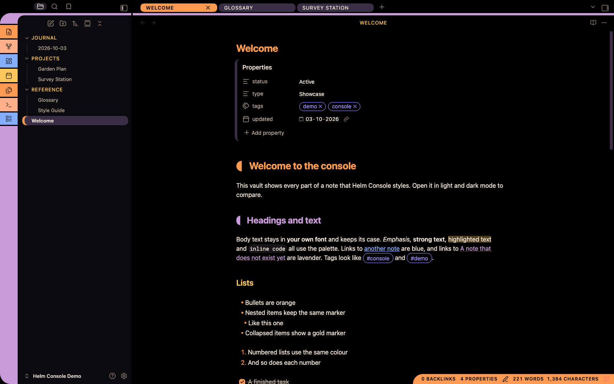</p>

<p align="center">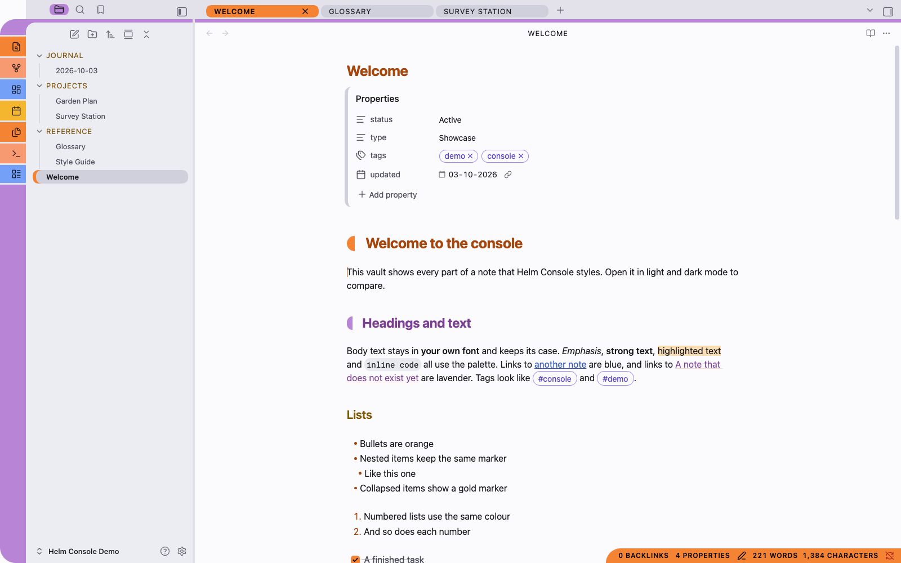</p>

**What to compare between the two:**

1. **The page.** Pure black in dark mode, near-white in light mode.
2. **The frame**, meaning the tab row along the top and the strip between the sidebar
   and the page. Black in dark mode, a light cool grey in light mode.
3. **The sidebar.** A near-black panel in dark mode and a slightly darker grey than the
   frame in light mode. Either way it reads as its own surface.
4. **The bars** (ribbon segments, the active tab, the status bar). The same hues in both
   modes, a little more saturated in light mode. Labels on them are always black.
5. **Coloured text** (the note title, headings, links, folder names). Bright in dark
   mode, deeper in light mode, so it meets the same 4.5:1 contrast on white.

**Try it:** open **Settings → Appearance**, set **Base colour scheme** to **Light**,
then back to **Dark**. Nothing moves; only the colours change.

---

## 3. A tour of the window

### The ribbon and the elbow

<table><tr>
<td>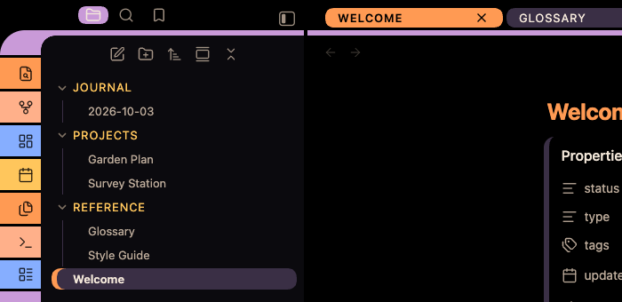</td>
<td>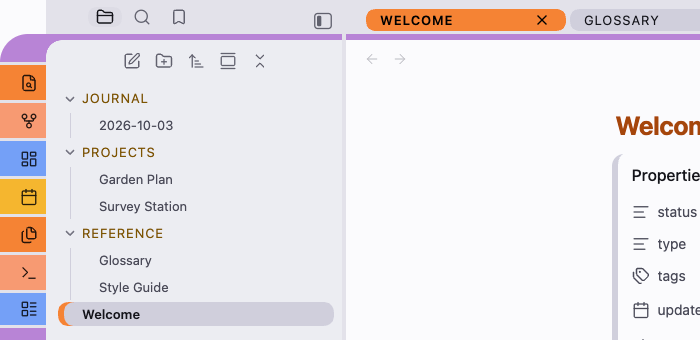</td>
</tr></table>

**What you're looking at, from left to right:**

1. **The ribbon segments.** One coloured block per ribbon icon, separated by thin gaps
   in the frame colour.
2. **The elbow.** The ribbon's rounded top-left corner, which turns into the lavender bar
   running under the tab row. Look at the inside of the bend, where the sidebar begins:
   a small concave curve completes the shape.
3. **The file explorer.** Folder names in gold capitals, notes in normal text, and the
   open note (**Welcome**) as a dim bar with an orange cap on its left.

The **ribbon** is the column of icons at the far left of the window. Starship Console draws
it as a stack of coloured segments, one per icon, separated by thin gaps. The colours
repeat in the order orange, peach, blue, gold. The buttons at the foot (help and
settings) are violet. Icons are drawn in black on the segments, and a segment turns red
under the pointer.

The top of the ribbon curves to the right into a lavender bar that runs along the foot
of the tab row. A small concave curve fills the inside corner where they meet. This
joined shape is the **elbow**, the signature of the style.

On macOS, Obsidian keeps a strip at the top-left of the window clear for the window
buttons (close, minimise, zoom), so the ribbon starts just below that strip, level with
the tab-row bar.

If you'd rather have a plain ribbon, turn on **Plain ribbon** (see
[Style Settings switches](#7-style-settings-switches)).

### Tabs

Every tab is a **pill** with rounded ends, and labels are in capitals.

<p align="center">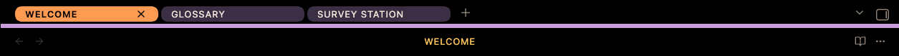</p>
<p align="center">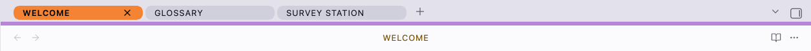</p>

In these strips, **WELCOME** is the active tab in the pane you're working in, so it is
orange. **GLOSSARY** and **SURVEY STATION** are inactive, so they are dim pills. The
lavender line beneath them is the bar the ribbon's elbow turns into.

**Try it:** move the pointer over an inactive tab and it turns violet. Split the window
(**right-click a tab → Split right**) and click in the other pane: the tab you left turns
peach, and the pane you're in gets the orange one.

| Tab state | Looks like |
| --- | --- |
| Inactive | A dim pill with light text (dark mode) or dark text (light mode) |
| Under the pointer | Violet, with black text |
| Active, in another pane | Peach, with black text |
| Active, in the pane you're working in | Orange, with black text |

The sidebars' tabs are icons. The active one sits in a lavender pill.

### Sidebars

Sidebars sit on their own panel colour: near-black in dark mode, light grey in light
mode. This keeps them visually separate from the page.

### The file explorer

- **Folder names** are gold and in capitals.
- **The open file** is a dim bar with an orange cap on its left edge.
- **Other selected files** (when you select several) carry a gold cap.
- Disclosure arrows are orange.

The open file deliberately isn't a bright fill. Plugins that colour file names (see
[Plugins](#9-plugins)) would otherwise become unreadable on it.

### View headers and breadcrumbs

The title at the top of each page is gold and in capitals. The breadcrumb path beside
it is muted.

### The status bar

The status bar in the lower right is an **orange bar with a rounded left end**. Its
text and icons are black. Clickable items turn gold under the pointer.

<p align="center"></p>
<p align="center">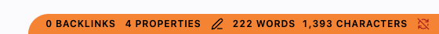</p>

The labels (backlinks, properties, word and character counts) come from Obsidian and
any plugins you use. The theme only draws the bar around them and capitalises them.

### Dividers and scrollbars

The gaps between panes take the frame colour: black in dark mode, light grey in light
mode. Scrollbar thumbs are rounded. They are dim at rest and turn lavender while you
drag them.

---

## 4. A tour of your notes

Starship Console never changes your note text. Its font is your font, and its case is your
case. Only the decorations around it change.

The overview screenshots in [section 2](#2-choosing-dark-or-light) show the top of the
demo note `Welcome` in live preview: the title, the properties block, the H1 and H2
caps, emphasis, highlighted text, inline code, both kinds of link, tags and lists. The
screenshots below show the rest of it in reading view.

<p align="center">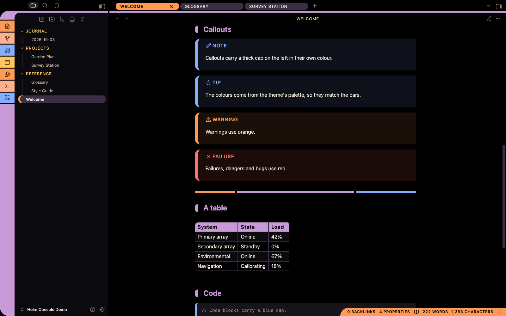</p>
<p align="center">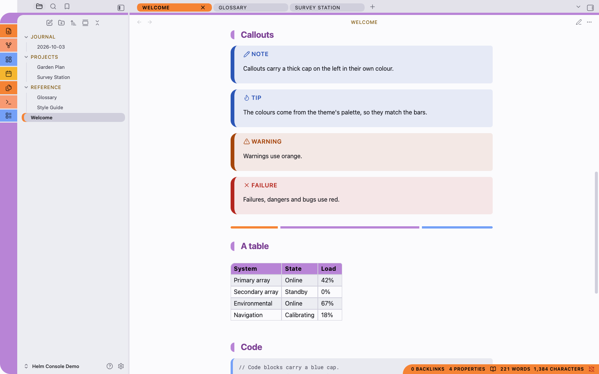</p>

**What you're looking at, from top to bottom:**

1. **An H2 heading** ("Callouts") with its lavender end cap. The cap is centred on the
   heading text and stands clear of it.
2. **Four callouts:** note and tip in blue, warning in orange, failure in red. Each has a
   thick cap in its own colour on the left and a light tint of the same colour behind it.
   The titles are capitals.
3. **A horizontal rule**, drawn as a segmented bar: orange, lavender, blue.
4. **A table** with a lavender header row and black labels, and tinted alternate rows.
5. **The start of a code block**, with its blue cap on the left and its own background.

**Try it:** in the demo vault, open `Welcome` and press **Cmd/Ctrl + E** to switch between
live preview and reading view. The caps, callouts, rule and table look the same in both.

### Headings

| Level | Colour | Decoration |
| --- | --- | --- |
| H1 | Orange | An orange end cap before the text, and a thin rule underneath in reading view |
| H2 | Lavender | A lavender end cap before the text |
| H3 | Gold | None |
| H4 | Blue | None |
| H5 | Violet | None |
| H6 | Grey | None |

The end caps are small blocks with a rounded outer edge and a straight inner edge,
centred on the heading text with a gap before it. They look the same in live preview and
reading view. To remove them, turn on **Plain headings**.

The note's title at the top of the page (the inline title) is orange.

### Lists

Bullets and numbers are orange. A collapsed list item's marker is gold.

### Links

- Links to other notes and to websites are **blue**, turning orange under the pointer.
- Links to notes that don't exist yet are **lavender**.

### Quotes

Block quotes have a thick lavender bar down their left side.

### Callouts

Callouts have a thick cap on the left in the callout's colour, rounded at the outer
corners, and a light tint of the same colour behind the text. Titles are in capitals.

The callout colours come from the theme's palette, so they match the bars:

| Callout types (examples) | Colour |
| --- | --- |
| note, info, todo, tip, important | Blue |
| success, check, done | Green |
| question, warning | Orange |
| failure, danger, bug | Red |
| example | Lavender |
| quote | Grey |

### Code

- Inline code and code blocks sit on their own background that stands apart from the
  page.
- Code blocks have a rounded blue cap on the left.
- Syntax colours use the palette: keywords lavender, strings green, functions gold,
  numbers and values orange, properties blue.

### Tables

The header row is a lavender bar with black labels, and its top-left corner is rounded.
Alternate body rows are lightly tinted to help your eye follow a row across.

### Horizontal rules

A horizontal rule (`---`) is a segmented bar: orange, then lavender, then blue, with
rounded ends.

### Tags

Tags are outlined violet pills.

### Properties

The properties block at the top of a note keeps Obsidian's own layout. Property names are
gold, and a dim bar runs down the block's left side.

### Highlights and selection

Highlighted text (`==like this==`) gets a gold tint. Selected text gets an orange tint.

---

## 5. Controls, menus and messages

### Buttons

| Button | Looks like |
| --- | --- |
| Ordinary button | A lavender pill with black text |
| Main action (for example **Install**, **Save**) | An orange pill |
| Destructive action (for example **Delete**) | A red pill |
| Under the pointer | Gold |
| Disabled | A dim pill with muted text |

Small buttons inside properties, notices, note content, the editor, the file tree, the
status bar and view headers are left unfilled, so they don't crowd the content.

### Text fields and dropdowns

These keep Obsidian's own shapes in the theme's colours. When a field has keyboard
focus it gets a gold ring.

### Toggles

Toggles are pills: orange with a black knob when on, dim with a lighter knob when off.

### The command palette and quick switcher

The selected result is a full **orange bar** with black text. The letters that match
what you typed are underlined on the selected row and orange on the others.

<table><tr>
<td><a href="docs/images/03-palette-dark.png">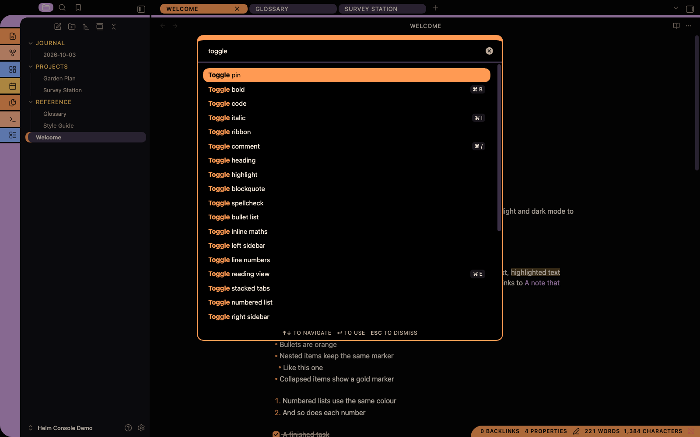</a></td>
<td><a href="docs/images/03-palette-light.png">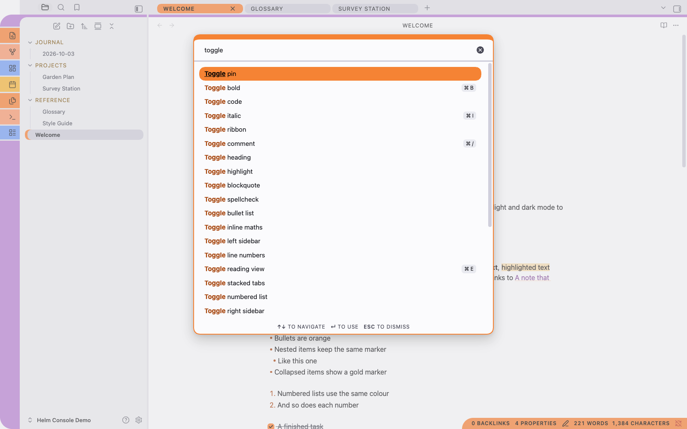</a></td>
</tr></table>

**What you're looking at:** the palette after typing "toggle". The thick orange edge at
the top marks the palette as the active panel. **Toggle pin** is selected, so it is the
orange bar and its matching letters are underlined. In every other result, "Toggle" is
picked out in orange (dark) or a deep orange (light). Keyboard shortcuts sit at the right
as small keys, and the hints along the bottom are capitals.

**Try it:** press **Cmd/Ctrl + P**, type a few letters, and use the arrow keys. The orange
bar follows your selection.

### Menus

Right-click menus are rounded panels with a lavender border. The row under the pointer
becomes a lavender bar. Destructive items (such as **Delete**) become a red bar under the
pointer.

<table><tr>
<td>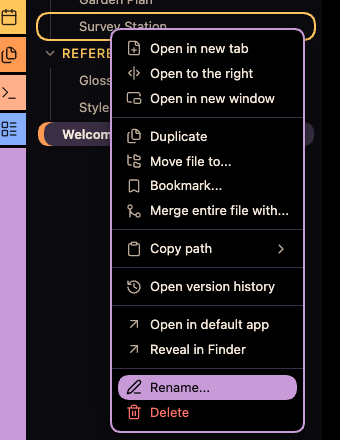</td>
<td>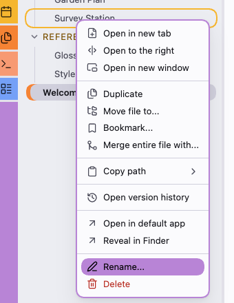</td>
</tr></table>

**What you're looking at:** the menu for the note **Survey Station**, opened by
right-clicking it in the file explorer. The gold outline around **Survey Station** shows
which file the menu belongs to. **Rename…** is under the pointer, so it is a lavender
bar with a black label and icon. **Delete** is red, because it can't be undone.

### Dialogs

Dialogs have a lavender border with a thicker top edge, and an orange title.

### Settings

The section list on the left shows the selected section as an orange bar. Group titles
are gold, and setting headings are orange.

<table><tr>
<td><a href="docs/images/04-settings-dark.png">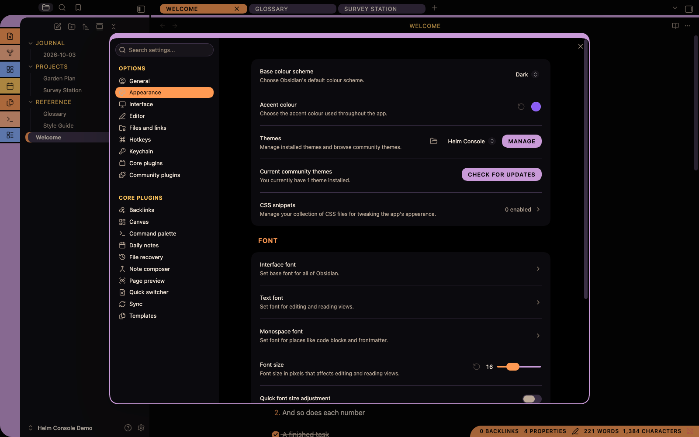</a></td>
<td><a href="docs/images/04-settings-light.png">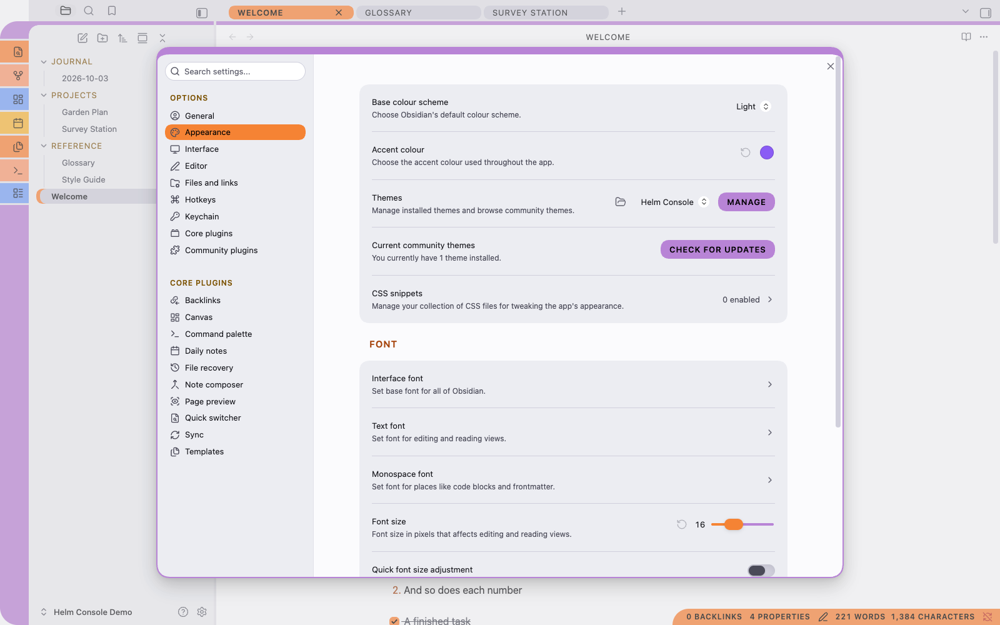</a></td>
</tr></table>

**What you're looking at:** **Settings → Appearance**.

1. **Appearance** in the section list is the orange bar, because it is the open section.
   **OPTIONS** and **CORE PLUGINS** are gold group titles.
2. **MANAGE** and **CHECK FOR UPDATES** are ordinary buttons: lavender pills with black
   capitals.
3. **FONT** is a setting heading, in orange.
4. The **font size slider** has an orange thumb, and the toggle at the bottom shows its
   off state: a dim pill with a visible knob.
5. The **Accent colour** swatch shows Obsidian's own accent setting. Starship Console sets its
   accents itself, so changing this has no effect (see
   [Troubleshooting](#the-accent-colour-setting-does-nothing)).

Obsidian can open Settings in a window of its own (**Settings → Interface → Open settings
in new window**). The theme styles it the same way in either place.

### Notices (pop-up messages)

Obsidian's pop-up messages, including errors and sync messages, appear as panels with a
**gold border and a thick gold cap** on the left. The background is the theme's panel
colour, so the message text, links and buttons inside stay readable in both modes.

<table><tr>
<td>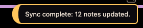</td>
<td>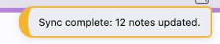</td>
</tr></table>

Notices appear in the top-right corner of the window and disappear by themselves after a
few seconds. Click one to dismiss it sooner.

### Tooltips

Tooltips are peach pills with black text.

---

## 6. Fonts

Starship Console sets **no fonts**. It always uses Obsidian's default fonts, or whatever you
choose under **Settings → Appearance → Font**:

- **Interface font**: menus, tabs, sidebars, settings.
- **Text font**: your notes.
- **Monospace font**: code.

The theme only changes *how* interface labels look (capitals with open letter spacing),
never *which* font they use.

**Tip:** the style traditionally uses a tall, narrow typeface for interface labels. If
you'd like that look, install a condensed font on your computer and choose it as your
**Interface font**. Your notes keep your text font.

---

## 7. Style Settings switches

Starship Console works without plugins. If you install the free
[Style Settings](https://github.com/mgmeyers/obsidian-style-settings) plugin, open
**Settings → Style Settings → Starship Console inspired by LCARS** for three switches:

### Mixed-case interface labels

Turns off the capitals on tab titles, view headers, folder names, buttons, the status
bar, callout titles and settings headings. Labels then appear in their original case.
Your note text is never capitalised either way.

### Plain ribbon

Replaces the segmented, swept ribbon with a single plain panel with a lavender edge, and
removes the lavender bar along the foot of the tab row. Choose this for a quieter
window.

### Plain headings

Removes the end caps from first- and second-level headings. The heading colours stay.

All three switches are off by default.

---

## 8. Customising with a CSS snippet

Every colour and size in Starship Console is a CSS variable whose name starts with `--hc-`.
You can change any of them with a CSS snippet, without editing the theme. Your changes
survive theme updates.

### Creating a snippet

1. Open **Settings → Appearance**, scroll to **CSS snippets** and click the folder
   icon. This opens your vault's `.obsidian/snippets` folder.
2. Create a text file there named, for example, `helm-console-custom.css`.
3. Paste in one of the examples below and save.
4. Back in **Settings → Appearance → CSS snippets**, click the refresh icon and turn
   your snippet on.

### Changing colours

Colours are set separately for each mode. Use `.theme-dark` for dark mode and
`.theme-light` for light mode:

```css
/* A redder orange in dark mode */
.theme-dark {
  --hc-bar-orange: #ff7f2a;
  --hc-ink-orange: #ff7f2a;
}

/* A warmer page in light mode */
.theme-light {
  --hc-screen: #fdfbf7;
}
```

Bar colours (`--hc-bar-*`) are fills that carry black labels. Ink colours
(`--hc-ink-*`) are text drawn directly on the page. If you change a colour, check that
text on it stays readable: aim for a contrast ratio of 4.5:1 or more.

#### Colour variables

| Variable | What it colours |
| --- | --- |
| `--hc-screen` | The page |
| `--hc-frame` | Tab rows, ribbon gaps, dividers |
| `--hc-panel` | Sidebars |
| `--hc-surface` | Fields and raised surfaces |
| `--hc-surface-hover` | Rows and controls under the pointer |
| `--hc-code-bg` | Code |
| `--hc-text`, `--hc-text-muted`, `--hc-text-faint` | Text, from strongest to faintest |
| `--hc-on-bar` | Labels on bars (black) |
| `--hc-bar-orange`, `-gold`, `-peach`, `-lavender`, `-violet`, `-blue`, `-red`, `-dim` | The bars |
| `--hc-ink-orange`, `-gold`, `-lavender`, `-violet`, `-blue`, `-red`, `-green` | Coloured text |
| `--hc-selection`, `--hc-highlight` | Selected and highlighted text |

### Changing sizes

Sizes are shared by both modes. Set them on `body`:

```css
body {
  --hc-heading-gap: 1em;     /* more space between heading caps and text */
  --hc-cap: 0.4em;           /* thinner heading caps */
  --hc-bar: 4px;             /* thinner bars, rules and quote bars */
  --hc-elbow: 20px;          /* a tighter elbow curve */
}
```

#### Size variables

| Variable | Default | What it sets |
| --- | --- | --- |
| `--hc-elbow` | `28px` | Radius of the ribbon's elbow curve |
| `--hc-bar` | `6px` | Thickness of the tab-row bar, rules, quote bars and caps on the file explorer |
| `--hc-gap` | `3px` | Gap between ribbon segments |
| `--hc-cap` | `0.55em` | Width of the H1 end cap (the H2 cap is 80% of this) |
| `--hc-cap-width` | `10px` | Width of the cap on callouts and notices |
| `--hc-radius-s` | `6px` | Small corner radius (checkboxes, the square side of caps) |
| `--hc-radius-m` | `12px` | Medium corner radius (menus, fields, code blocks, tables) |
| `--hc-heading-gap` | `0.75em` | Space between a heading cap and its text |
| `--hc-panel-radius` | `18px` | Corner radius of dialogs, callouts and notices |
| `--hc-ribbon-width` | `46px` | Width of the ribbon |
| `--hc-label-tracking` | `0.07em` | Letter spacing of capitalised labels |

### Examples

**Square off the tabs:**

```css
.workspace .mod-root .workspace-tab-header {
  border-radius: 6px;
}
```

**Give the active tab the gold bar instead of orange:**

```css
.workspace .mod-root .workspace-tabs.mod-active .workspace-tab-header.is-active {
  background: var(--hc-bar-gold);
}
```

---

## 9. Plugins

Starship Console is designed to work with plugins without special support from them.

### Plugin buttons

Many plugins add buttons to their own views. Starship Console sets button colours through
Obsidian's standard variables, scoped to each button, so a plugin that restyles its
buttons with those variables still gets black labels on a coloured bar. A plugin's own
active or selected style (an underline, say) still shows, because the theme's button
rule is deliberately low in priority.

### File-colour plugins

Plugins that colour file and folder names in the explorer set those colours directly on
each name. Starship Console shows the open file as a dim bar with an orange cap, so the
plugin's colour stays readable on it.

### Style Settings

See [Style Settings switches](#7-style-settings-switches).

### If a plugin looks wrong

Most problems come from a plugin that sets its own colours or backgrounds without using
Obsidian's variables. Try this:

1. Switch to Obsidian's default theme. If the plugin still looks wrong, the problem is
   in the plugin, not the theme.
2. If it only looks wrong with Starship Console, open an issue with a screenshot and the
   plugin's name.
3. In the meantime, a CSS snippet can usually fix it (see
   [Customising with a CSS snippet](#8-customising-with-a-css-snippet)).

---

## 10. Accessibility

- **Contrast.** All text meets the WCAG 4.5:1 contrast ratio against its background, in
  both modes. Labels on bars meet 4.5:1. Disabled controls and switched-off toggles meet
  3:1. Automated tests check every pairing, so a change that breaks contrast can't be
  released.
- **Keyboard focus** is always shown as a gold outline, so you can see where you are
  when navigating by keyboard.
- **Reduced motion.** If you turn on reduced motion in your operating system, Helm
  Console sets Obsidian's animation timings to zero, so panels, menus and dialogs appear
  without animating.
  - macOS: **System Settings → Accessibility → Display → Reduce motion**.
  - Windows: **Settings → Accessibility → Visual effects → Animation effects** (off).
- **Increased contrast.** If you turn on increased contrast in your operating system,
  muted and faint text is drawn at full strength and borders are strengthened.
  - macOS: **System Settings → Accessibility → Display → Increase contrast**.
- **Capitals.** Some readers find capitalised labels slower to read. Turn on
  **Mixed-case interface labels** to switch them off.
- **Weight as well as colour.** The active tab's label and the open file's name are
  drawn bolder, and the open file also carries an orange cap, so these states don't rely
  on colour alone.

---

## 11. Printing and PDF export

When you print a note or export it as a PDF, Starship Console drops its screen styling: the
page is white, all text and headings are black, links are black, and the heading caps are
removed. Code keeps a pale grey background. Your printed notes look like an ordinary
document, not a screenshot of the console.

---

## Troubleshooting

### The theme doesn't appear in Settings → Appearance

- Check the folder name is exactly `Starship Console inspired by LCARS`, with the same capitals and single spaces.
- Check the folder contains both `theme.css` and `manifest.json`, not a subfolder holding
  them.
- Check the folder is inside `.obsidian/themes/` in the vault you have open.
- Restart Obsidian.

### I updated the theme but nothing changed

Obsidian doesn't reload a theme when its file changes. Switch to another theme and back,
or restart Obsidian.

### My fonts look different from the screenshots

Starship Console uses your own font settings. Check **Settings → Appearance → Font**.

### Everything is in capitals and I don't want that

Install Style Settings and turn on **Mixed-case interface labels**. Your note text is
never capitalised.

### The heading caps sit oddly or collide with text

The caps are sized to the heading text. If you use a very large or very unusual heading
font, adjust them with `--hc-cap` and `--hc-heading-gap` in a snippet, or turn on
**Plain headings**.

### The ribbon's elbow looks misaligned

The elbow is tuned for Obsidian's default window frame on macOS, where the title bar is
hidden. With a native title bar (**Settings → Interface → Window frame style**), or on
Windows and Linux, the ribbon may start slightly differently. Turn on **Plain ribbon** if
it bothers you, and please open an issue with a screenshot.

### A plugin's buttons or panels look wrong

See [If a plugin looks wrong](#if-a-plugin-looks-wrong).

### The accent colour setting does nothing

Starship Console sets its own accent colours (orange, gold and the other bars), so Obsidian's
**Accent colour** setting has no effect. To change the accent, use a snippet that sets
`--hc-bar-orange` and `--hc-ink-orange` (see
[Changing colours](#changing-colours)).

### Menus look different from the screenshots

On macOS, Obsidian can use the system's native menus instead of its own. Native menus
are drawn by macOS, so no theme can style them. To get the theme's menus, turn off
**Settings → Interface → Native menus** (in the **Advanced** group).

### Something looks wrong after an Obsidian update

Obsidian occasionally renames parts of its interface. If something that looked right
before an update now looks wrong, open an issue with a screenshot and your Obsidian
version (**Settings → General**).

---

## FAQ

**Is this an official theme?**
No. Starship Console is an independent, unofficial, fan-made theme. It isn't affiliated with,
endorsed by, sponsored by, or connected to Paramount Global, CBS Studios or any other
rights-holder.

**What is it inspired by?**
LCARS, the computer interface style seen on screen in *Star Trek: The Next Generation*:
flat coloured bars, rounded end caps and curved joins between panels. Starship Console
recreates the general style in original CSS. It copies no graphics from the show.

**Why is it called Starship Console inspired by LCARS?**
The theme's own name is Starship Console. "Inspired by LCARS" says which style it draws on,
the way the Amiga Workbench themes name theirs. It doesn't claim the name LCARS: a theme
called "LCARS" is already in Obsidian's community directory, and LCARS belongs to the Star
Trek franchise, so it appears only as a description, never as the theme's name on its own.
Versions before 1.0.2 were called Starship Helm Console; see **Updating** for moving an
existing install.

**Does the theme include any artwork from the shows?**
No. Every shape is drawn with ordinary CSS: borders, rounded corners and gradients. There
are no images, logos, insignia, screen graphics or proprietary fonts.

**Does the theme download anything?**
No. It loads no fonts, images or other files from the internet.

**Does it work on mobile?**
It hasn't been tested on mobile yet. It is plain CSS, so it should load, but some parts
may look different.

**Can I use only the dark mode?**
Yes. Set **Settings → Appearance → Base colour scheme** to **Dark**.

**Can I change the colours?**
Yes, with a CSS snippet. See
[Customising with a CSS snippet](#8-customising-with-a-css-snippet).

**Does it slow Obsidian down?**
It shouldn't. The theme is a single stylesheet with no scripts, no images and no
expensive visual effects such as blurs or animated backgrounds.

---

## 14. Uninstalling

1. Open **Settings → Appearance** and choose another theme, or **Default**.
2. Optionally, delete the `.obsidian/themes/Starship Console inspired by LCARS/` folder.
3. If you made a snippet for Starship Console, turn it off or delete it under
   **Settings → Appearance → CSS snippets**.

Starship Console stores no settings of its own. Style Settings keeps its switch positions in
its own settings until you reset them there.

---

## 15. Getting help

Open an issue on the theme's repository. Please include:

- a screenshot of the problem,
- your Obsidian version (**Settings → General**),
- your operating system,
- whether you're in dark or light mode,
- any plugins involved.
